# Understanding NeuroLup Battery Results

[WorkInProgress] This document is a guide to understand the battery results recorded using NeuroLup.

## Table of Contents
- [Introduction](#sec-introduction)
- [Battery Result Explanation](#sec-battery-result-explanation)
- [Exercises](#sec-exercises)
   - [Exercise 1: 30 Sec Speech](#subsec-exercise01)
   - [Exercise 2: Say “Ah”](#subsec-exercise02)
   - [Exercise 3: Grid Match](#subsec-exercise03)
   - [Exercise 4: Finger Tapping Test](#subsec-exercise04)
   - [Exercise 5: Tracing of a Line](#subsec-exercise05)
   - [Exercise 6: DSST](#subsec-exercise06)
   - [Exercise 7: Stroop Test](#subsec-exercise07)
   - [Exercise 8: Picture Description](#subsec-exercise08)
   - [Exercise 9: Unstructured Voice Tasks (Verbal Fluency)](#subsec-exercise09)
   - [Exercise 10: Orientation Questions](#subsec-exercise10)
   - [Exercise 11: Unstructured Voice Tasks (Open-Ended Questions)](#subsec-exercise11)
   - [Exercise 12: Reaction Time Exercise](#subsec-exercise12)
- [Battery Result Example With All Exercises](#sec-battery-result-example-all-exercises)

***

<a id="sec-introduction"></a>
## Introduction

NeuroLup offers various cognitive assessments, known coloquially as "brain games" or "cognitive exercises". NeuroLup also provides the flexibility to create custom test batteries by selecting any combination of these exercises. When a participant successfully finishes a battery, the system generates a comprehensive battery result. This battery result is a collection of results for exercises available within that specific battery.

A battery result is represented using a JSON object. The following is an example of a battery result:

```json
{
  "battery_metadata": {
    "participant_id": "email_or_username",
    "program_name": "sample_program_name",
    "battery_name": "sample_battery_name",
    "created_at": "creation_date_and_time",
    "updated_at": "updation_date_and_time",
    "device_info":  {}
  },
  "battery_result": {
    "exercise02": {
      "exercise_id": "exercise02",
      "exercise_metadata": {},
      "exercise_result": {
        "file_path": "path/to/the/audio/file"
      }
    },
    "exercise04": {
      "exercise_id": "exercise04",
      "exercise_metadata": {},
      "exercise_result": {
        "right_index_finger_taps": [17, 38, 58, 81, 102, 127, 147, 169, 192, 212],
        "left_index_finger_taps": [15, 35, 55, 75, 93, 115, 132, 152, 170, 188, 2062]
      }
    }
  }
}
```

The rest of this document explains the different fields used here and their values.

***

<a id="sec-battery-result-explanation"></a>
## Battery Result Explanation
A battery result JSON object contains the battery results and certain information about the battery, including the participant identifier, program name, and battery name. It consists of two fields:

### `battery_metadata` (object)
This object contains information about the battery results using the following fields:

- `participant_id` (string): Participant identifier
- `program_name` (string): Program name
- `battery_name` (string): Battery name
- `created_at` (string): Creation time for the battery results
- `updated_at` (string): Updation time for the battery results (if applicable)
- `device_info` (object): Available information about the device used to complete the battery exercises

### `battery_result` (object)
This object contains the results for the exercises available with the battery in a `key:value` format. Each `key` refers to an exercise, and each `value` is an object representing the exercise results.

<a id="sec-exercise-key"></a>
#### `key` (string):

At the time of writing, NeuroLup offers 12 exercises, each identified with a key in the format `exerciseXX`, where `XX` represents the exercise number. For example, the [Introduction](#sec-introduction) shows that the `battery_result` object contains results for exercises 2 and 4, identified by the keys `exercise02` and `exercise04`.
#### `value` (object):
This object represents exercise results using the following nested fields:

- `exercise_id` (string): Exercise ID (same as the [key](#sec-exercise-key))
- `exercise_metadata` (object): Additional information required for the exercise results, which is exercise-specific (for more details, please refer to the [Exercises](#sec-exercises) section) 
- `exercise_result` (object): Exercise-specific results (for more details, please refer to the [Exercises](#sec-exercises) section)

***

<a id="sec-exercises"></a>
## Exercises
Presently, NeuroLup offers a diverse range of 12 exercises. The following subsections provide an overview of each exercise and explain the response data gathered, accompanied by an illustrative object that represents the exercise result in battery results.

It is important to emphasize that the primary goal of this document is to provide a comprehensive understanding of the data associated with NeuroLup battery results. As a result, this document focuses on the technical aspects and rules of the exercises. (// ToDo: For deeper insights into the rationale behind each exercise, we encourage you to consult the provided links within each exercise subsection.)

***

<a id="subsec-exercise01"></a>
### Exercise 1: 30 Sec Speech

#### Overview
In this exercise, participants are required to read a short paragraph aloud. If there are colored words in the paragraph, participants should say the color, not the word. The Stroop effect is included primarily to divert attention away from articulation, aiding to unmask any speech difficulties otherwise attenuated with concentration. 

The exercise process is outlined as follows:
1. Instructions for the exercise are displayed. Participants can click the "Next" button to proceed.
   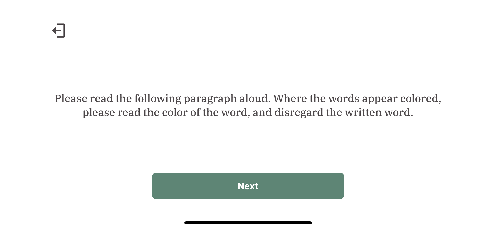
2. An example is displayed to help participants understand the exercise. Participants can click the "Start Recording" button when they are ready.
   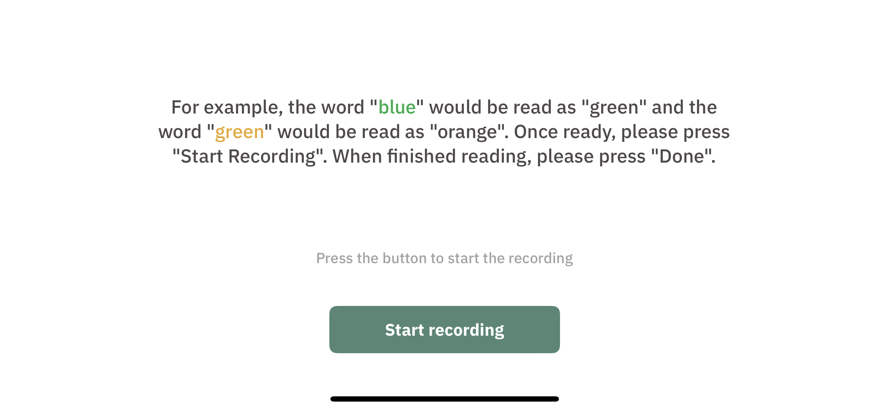
3. The paragraph to read will appear. Participants can record a response and click "Done" when finished.
   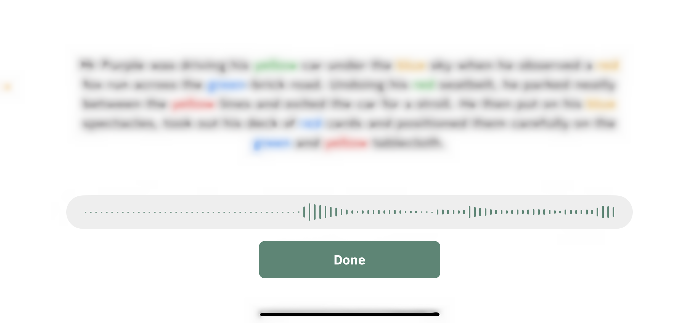
4. Participants can choose to re-record their response ("Redo"), listen to what they have recorded ("Play to check"), or move on to the next activity ("Next").
   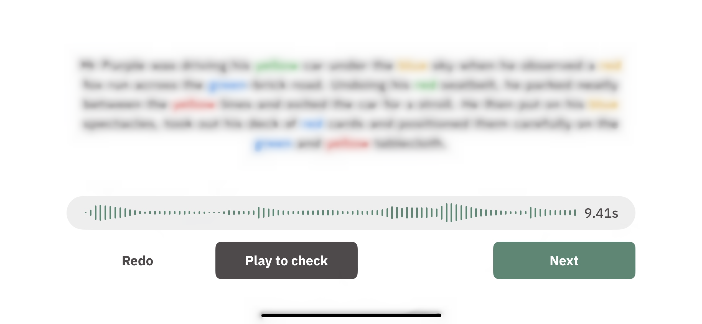

#### Response data
The speech response is recorded using a single 32-bit, mono, ```.wav``` audio file with 22050Hz sample rate.

#### Exercise Result
The following example shows the JSON object structure used for this exercise result:

```json
{
  "exercise_id": "exercise01",
  "exercise_metadata": {},
  "exercise_result": {
    "file_path": "path/to/the/audio/file"
  }
}
```

Let's try to understand the results recorded for this exercise using the fields of this JSON object.

##### `exercise_id` (string)
The default `exercise_id` value for exercise 1 is `exercise01`.

##### `exercise_metadata` (object)
Currently, there is no additional information required to process the recorded results for this exercise. Thus, an empty object is present here.

##### `exercise_result` (object)
This object contains the result using the following fields:
- `file_path` (string): Path to the location of the audio file with speech response

***

<a id="subsec-exercise02"></a>
### Exercise 2: Say “Ah”
#### Overview
In this exercise, participants are required to vocalize the sound "Ah" continuously for a duration of 5 seconds. Sustained intonation has been utilized as a language-agnostic indicator of movement disorders. 

The exercise process is outlined as follows:
1. Instructions for the exercise are displayed. Participants can click the "Start recording" button to record a response.
   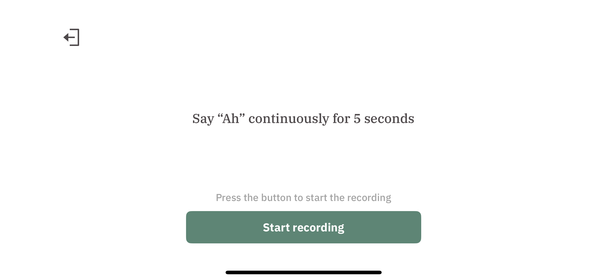
2. Participants have 5 seconds to record a response.
   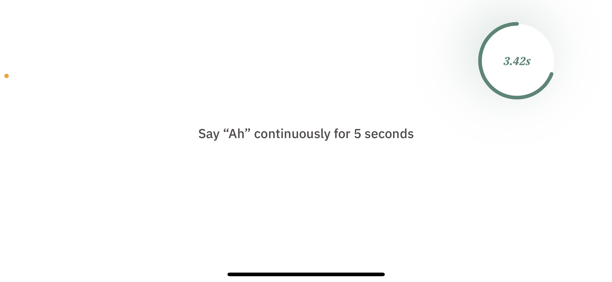
3. Participants can click "Next" to move on to the next activity.
   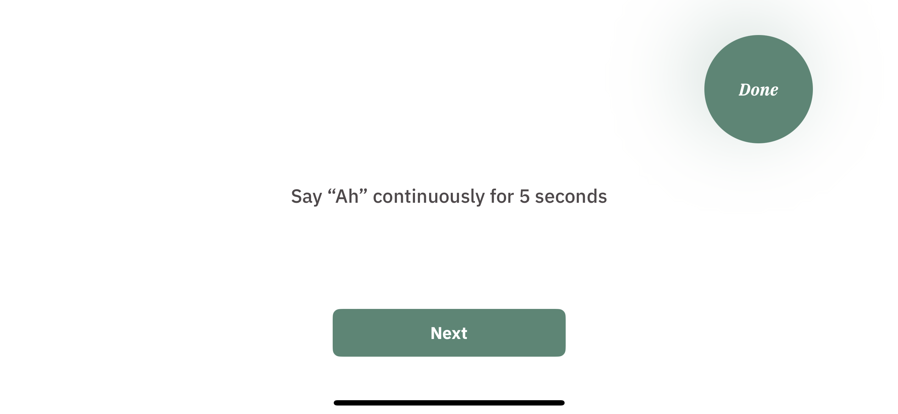

#### Response data
The speech response is recorded using a single 32-bit, mono, ```.wav``` audio file with 22050Hz sample rate.

#### Exercise Result
The following example shows the JSON object structure used for this exercise result:
```json
{
  "exercise_id": "exercise02",
  "exercise_metadata": {},
  "exercise_result": {
    "file_path": "path/to/the/audio/file"
  }
}
```
Let's try to understand the results recorded for this exercise using the fields of this JSON object.

##### `exercise_id` (string)
The default `exercise_id` value for exercise 2 is `exercise02`.

##### `exercise_metadata` (object)
Currently, there is no additional information required to process the recorded results for this exercise. Thus, an empty object is present here.

##### `exercise_result` (object)
This object contains the result using the following fields:
- `file_path` (string): Path to the location of the audio file with speech response

***

<a id="subsec-exercise03"></a>
### Exercise 3: Grid Match
#### Overview
In this exercise, participants are presented with a 3x3 grid where images are placed in various cells. Their task is to replicate this image arrangement on the grid within a specified time frame. The exercise is divided into three distinct trials, each progressively more challenging. The table below outlines the number of questions, the number of images per question, and the time limit per question for each trial.

This is a measure of visual working memory. There is evidence that APOE ε4 carriers perform better than non-carriers in certain visual working memory tasks. There is evidence that individuals with MCI have reduced hippocampal activation during high working memory load and increased hippocampal activation during low load in comparison to healthy controls. This effect may be captured as this exercises becomes more challenging in trials 2 and 3.


| Trial | Number of Questions | Images per Question | Time Limit per Question |
|-------|---------------------|---------------------|-------------------------|
| 1     | 5                   | 1                   | 10 seconds              |
| 2     | 10                  | 3                   | 30 seconds              |
| 3     | 10                  | 5                   | 60 seconds              |

The exercise process is outlined as follows:
1. Exercise instructions are displayed. Participants can watch a demo with the "Watch Demo" button or click the "Start" button to begin the exercise trials.
   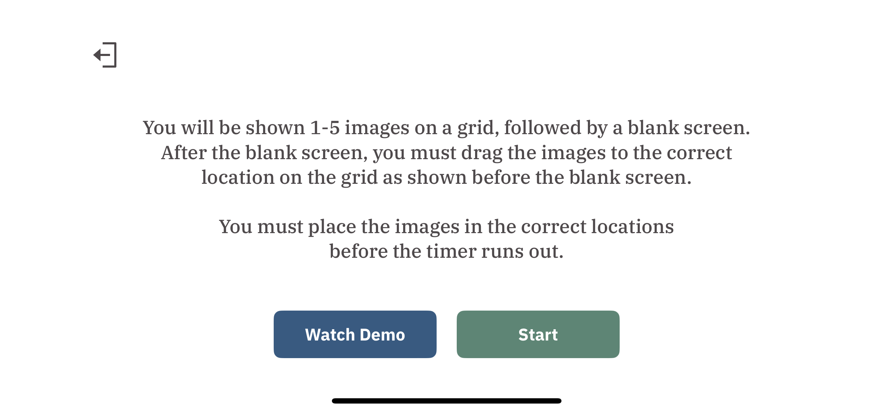
2. Trial 1 consists of 5 questions with a 10-second time limit to answer a question.
   -  For each question, participants are presented with a 3x3 grid with a single image placed in a random cell. The display lasts for 3 seconds. An example is shown below:
      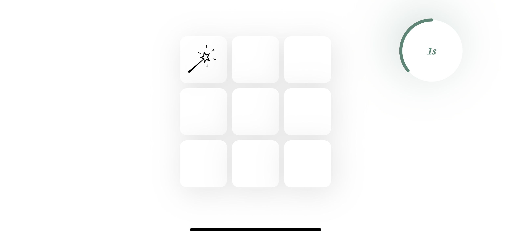
   - Participants are presented with an empty grid with the question image(s) on the left-hand side. The timer in the top right corner displays the time remaining to drag the image(s) to the correct location(s) on the grid. The button in the bottom right corner of the screen allows participants to proceed to the next question.
   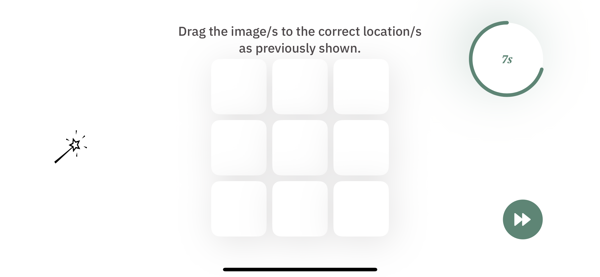
3. Trial 2 consists of 10 questions with a 30-second time limit to answer a question.
   - For each question, participants are presented with a 3x3 grid with 3 images placed in random cells. The display lasts for 3 seconds. An example is shown below:
     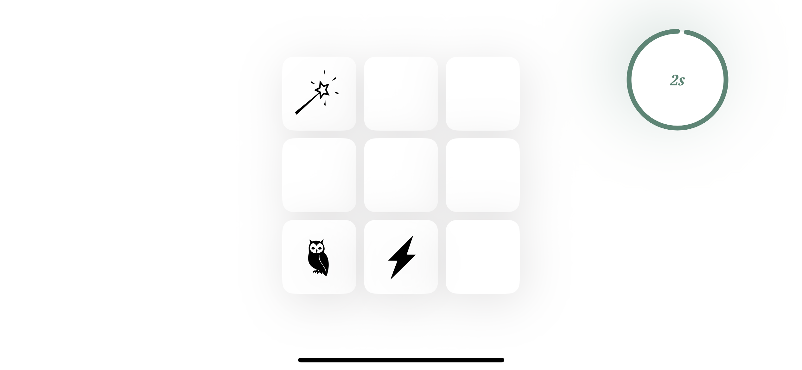
   - Participants are presented with an empty grid with the question image(s) on the left-hand side. The timer in the top right corner displays the time remaining to drag the image(s) to the correct location(s) on the grid. The button in the bottom right corner of the screen allows participants to proceed to the next question.
     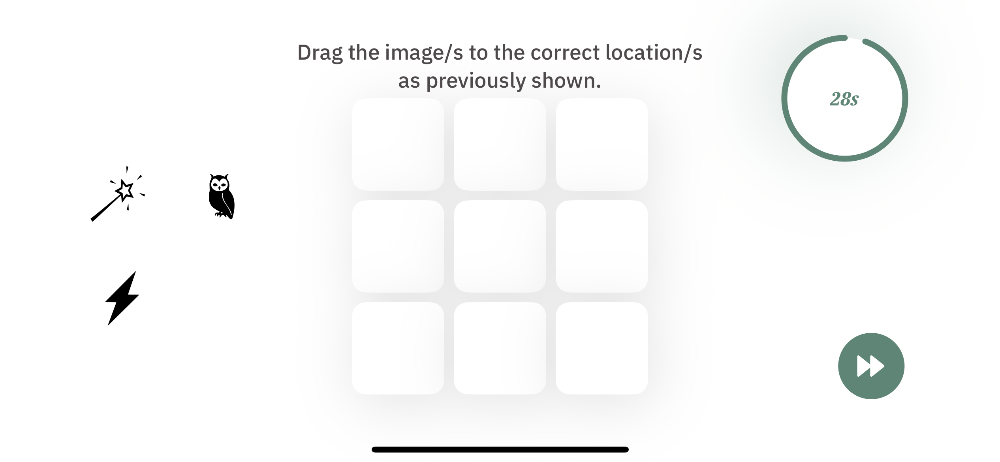
4. Trial 3 consists of 10 questions with a 60-second time limit to answer a question.
   - For each question, participants are presented with a 3x3 grid with 5 images placed in random cells. The display lasts for 3 seconds. An example is shown below:
     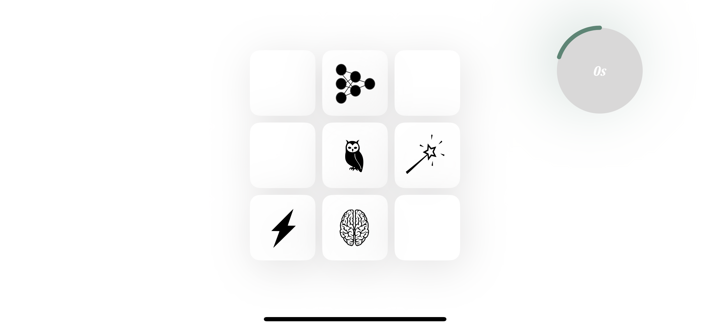
   - Participants are presented with an empty grid with the question image(s) on the left-hand side. The timer in the top right corner displays the time remaining to drag the image(s) to the correct location(s) on the grid. The button in the bottom right corner of the screen allows participants to proceed to the next question.
     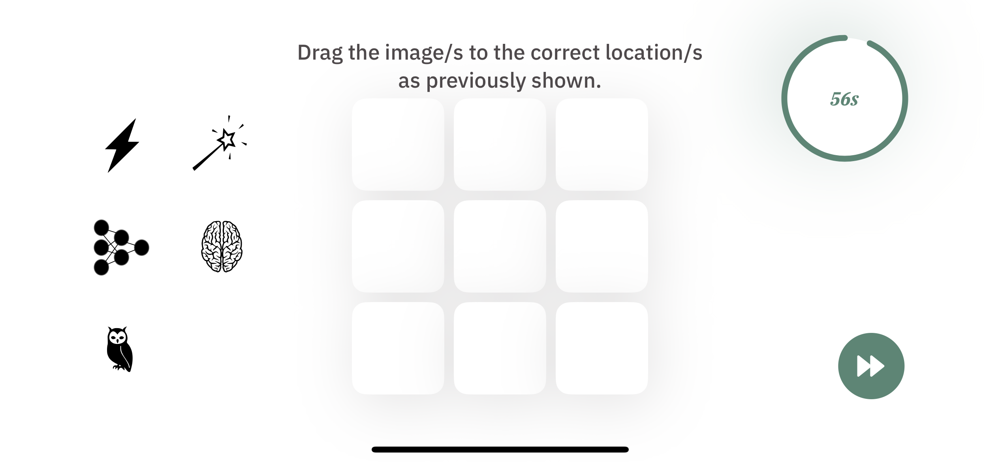
5. After completing all three trials, the following screen is displayed. Participants can click the "Next" button for the next activity.
   

#### Response data
Across all three trials, for every question, the following information is collected per image:
- Target grid position
  - Recorded position values are shown below

     | 1     | 2     | 3     |
     |-------|-------|-------| 
     | **4** | **5** | **6** |
     | **7** | **8** | **9** |
- Answered grid position
  - If an answer is provided for the image
    - Recorded position values are shown below

       | 1     | 2     | 3     |
       |-------|-------|-------| 
       | **4** | **5** | **6** |
       | **7** | **8** | **9** |
  - If the image was skipped
    - Recorded grid position value = **0**
  - If there was a timeout before an answer could be provided for the image
    - Recorded grid position value = **-1**

#### Exercise Result
The following example shows the JSON object structure used for this exercise result:
```json
{
  "exercise_id": "exercise03",
  "exercise_metadata": {},
  "exercise_result": {
    "trial1": [
      {
        "answered_pos": [9],
        "target_pos": [9]
      },
      {
       "answered_pos": [3],
       "target_pos": [3]
      },
      {
       "answered_pos": [3],
       "target_pos": [3]
      },
      {
       "answered_pos": [-1],
       "target_pos": [4]
      },
      {
       "answered_pos": [0],
       "target_pos": [6]
      }
    ],
    "trial2": [
      {
       "answered_pos": [6, 7, -1],
       "target_pos": [6, 7, 8]
      },
      {
       "answered_pos": [1, 0, 0],
       "target_pos": [1, 2, 4]
      },
      {
       "answered_pos": [-1, -1, -1],
       "target_pos": [5, 7, 9]
      },
      {
       "answered_pos": [0, 0, 0],
       "target_pos": [1, 4, 5]
      },
      {
       "answered_pos": [2, 3, 5],
       "target_pos": [2, 3, 5]
      },
      {
       "answered_pos": [5, 6, 9],
       "target_pos": [5, 6, 9]
      },
      {
       "answered_pos": [1, 2, 0],
       "target_pos": [1, 2, 5]
      },
      {
       "answered_pos": [1, 2, 3],
       "target_pos": [9, 4, 2]
      },
      {
       "answered_pos": [4, 6, 8],
       "target_pos": [4, 6, 8]
      },
      {
       "answered_pos": [4, 5, 9],
       "target_pos": [4, 5, 9]
      } 
    ],
    "trial3": [
      {
        "answered_pos": [2, 4, 5, 6, 7],
        "target_pos": [2, 4, 5, 6, 7]
      },
      {
       "answered_pos": [2, 3, 6, 8, 9],
       "target_pos": [2, 3, 6, 8, 9]
      },
      {
       "answered_pos": [2, 5, 6, 8, 9],
       "target_pos": [9, 8, 6, 5, 1]
      },
      {
       "answered_pos": [1, 2, 4, 5, 9],
       "target_pos": [1, 2, 4, 5, 9]
      },
      {
       "answered_pos": [1, 6, 7, 8, 9],
       "target_pos": [1, 6, 7, 8, 9]
      },
      {
       "answered_pos": [2, 3, 4, 5, 6],
       "target_pos": [3, 2, 4, 5, 6]
      },
      {
       "answered_pos": [1, 2, 4, 7, 8],
       "target_pos": [1, 2, 4, 7, 8]
      },
      {
       "answered_pos": [2, 3, 4, 7, 8],
       "target_pos": [3, 2, 4, 7, 8]
      },
      {
       "answered_pos": [1, 2, 6, 7, 8],
       "target_pos": [1, 2, 6, 8, 7]
      },
      {
       "answered_pos": [2, 3, 6, 8, 9],
       "target_pos": [2, 3, 6, 8, 9]
      }
    ]
  }
}
```

Let's try to understand the results recorded for this exercise using the fields of this JSON object.
##### `exercise_id` (string)
The default `exercise_id` value for exercise 3 is `exercise03`.

##### `exercise_metadata` (object)
Currently, there is no additional information required to process the recorded results for this exercise. Thus, an empty object is present here.

##### `exercise_result` (object)
This object contains the result using the following fields:
- `trial1` (list): List of objects containing the answers for trial 1 questions. Each object in the list has the following fields:
  - `answered_pos` (list): Image position(s) provided by the participants
  - `target_pos` (list): Target image position(s)

- `trial2` (list): List of objects containing the answers for trial 2 questions. Each object in the list has the following fields:
  - `answered_pos` (list): Image position(s) provided by the participants
  - `target_pos` (list): Target image position(s)

- `trial3` (list): List of objects containing the answers for trial 3 questions. Each object in the list has the following fields:
  - `answered_pos` (list): Image position(s) provided by the participants
  - `target_pos` (list): Target image position(s)

***

<a id="subsec-exercise04"></a>
### Exercise 4: Finger Tapping Test

#### Overview

In this exercise, participants are expected to tap a button as many times as they can within a 10-second time interval using their right or left index finger. This is a measure of neuropsychomotor speed. Performance abnormalities in this exercises area associated with many diseases and disorders, such as MCI, pMCI and AD.

The exercise process is outlined as follows:
1. Exercise instructions are displayed. Participants can click the "Start" button to begin the exercise.
   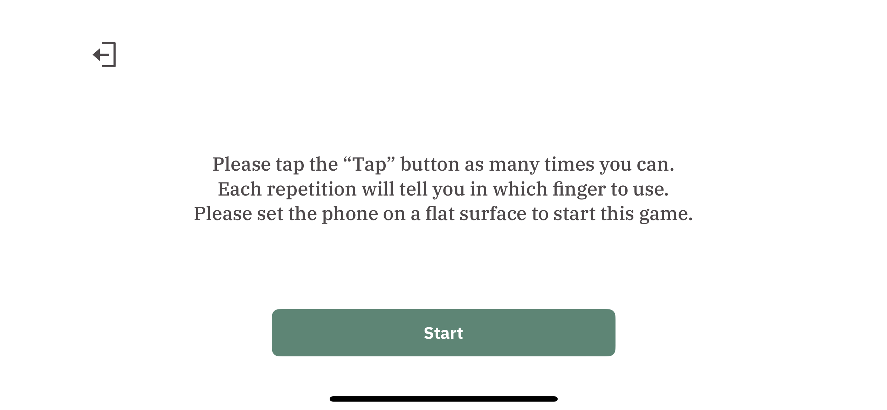
2. In the first trial of the exercise, participants are expected to use their right index finger. The following screen is displayed, and the timer starts once the "Start" button is tapped. Participants then have 10 seconds to tap the green button as many times as possible.
   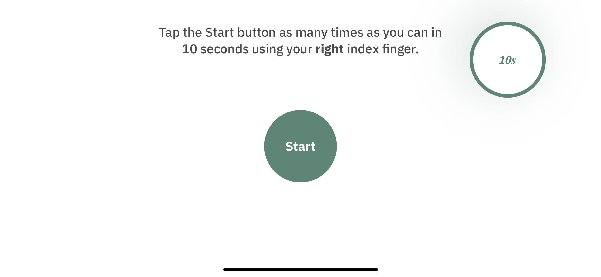
3. After the 10-second interval, the next screen is displayed. Participants can click "Start Trial 2" for the next trial.
   
4. Instructions for trial 2 are displayed. Participants can click the "Start" button to start the trial.
   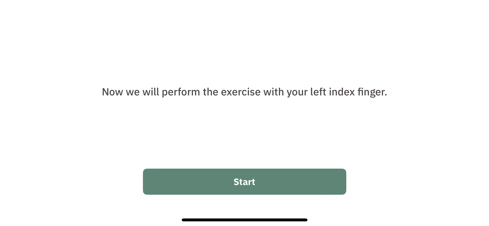
5. In the second trial of the exercise, participants are expected to use their left index finger. The following screen is displayed, and the timer starts once the "Start" button is tapped. Participants then have 10 seconds to tap the green button as many times as possible.
   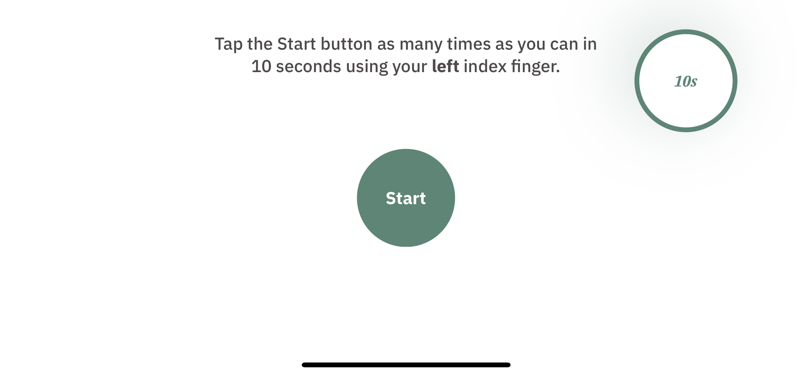
6. After the 10-second interval, the next screen is displayed. Participants can click "Next" for the next activity.
   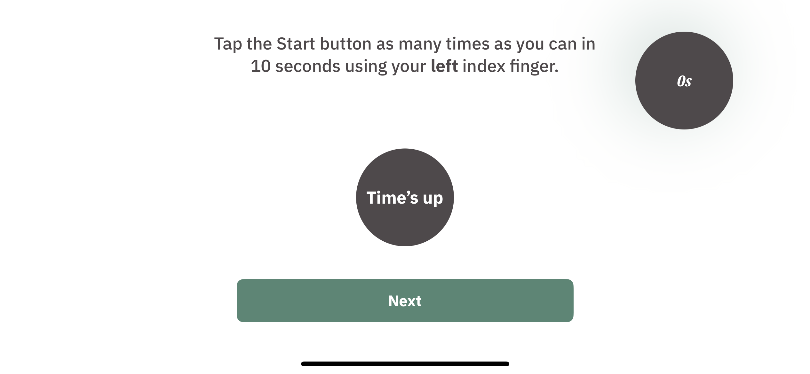
7. The final screen indicates that the exercise is completed. Participants can click "Next" for the next activity.
   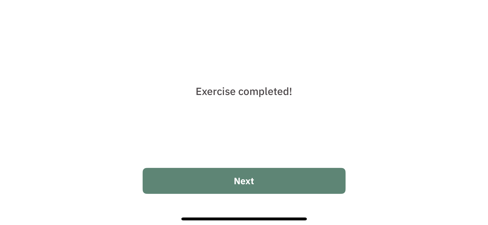

#### Response data
The response data for this exercise comprises records of finger taps for the right index finger and the left index finger, collected in 10-second intervals. Each finger tap is associated with a timestamp, measured in milliseconds and starting from 0.

#### Exercise Result
The following example shows the JSON object structure used for this exercise result:

```json
{
  "exercise_id": "exercise04",
  "exercise_metadata": {},
  "exercise_result": {
    "right_index_finger_taps": [17, 38, 58, 81, 102, 127, 147, 169, 192, 212, 232, 252, 272, 290, 312, 330, 349, 367, 389, 405, 425, 445, 464, 482, 502, 519, 539, 557, 579, 599, 619, 639, 657, 679, 699, 715, 735, 754, 772, 792, 809, 830, 852, 872, 892, 910, 928, 947, 963, 983],
    "left_index_finger_taps": [15, 35, 55, 75, 93, 115, 132, 152, 170, 188, 206, 222, 240, 259, 279, 299, 317, 337, 355, 377, 397, 417, 435, 457, 474, 494, 515, 532, 552, 570, 589, 609, 630, 650, 670, 690, 712, 732, 752, 774, 795, 814, 834, 854, 872, 894, 912, 930, 952, 972, 992]
  }
}
```

Let's try to understand the results recorded for this exercise using the fields of this JSON object.
##### `exercise_id` (string)
The default `exercise_id` value for exercise 4 is `exercise04`.

##### `exercise_metadata` (object)
Currently, there is no additional information required to process the recorded results for this exercise. Thus, an empty object is present here.

##### `exercise_result` (object)
This object contains the result using the following fields:
- `right_index_finger_taps` (list): Contains the timestamps for the right index finger taps
- `left_index_finger_taps` (list): Contains the timestamps for the left index finger taps

***

<a id="subsec-exercise05"></a>
### Exercise 5: Tracing of a Line
#### Overview
In this exercise, participants are expected to trace a reference line on the screen using either their right or left hand in the specified direction. This is a simple measure to quantify motor control and stability. 

The exercise is divided into two trials, as follows:
1. Trial 1 (Using the left hand):
   - Participants are asked to trace a line from left to right.
     
   - Once finished, participants can click "Next" to proceed.
     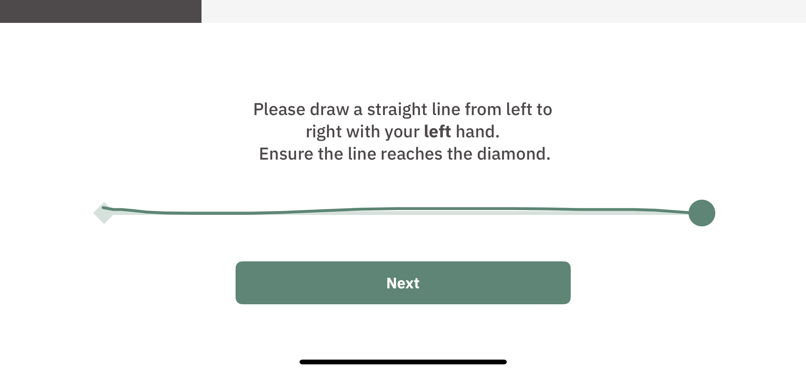
   - Participants are asked to trace a line from right to left.
     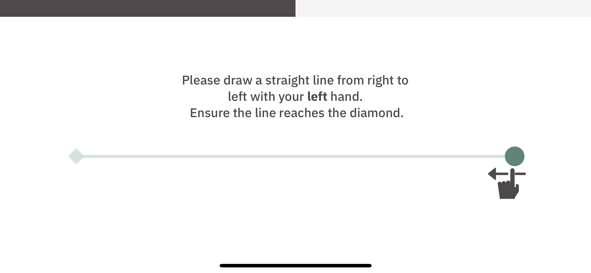
   - Once finished, participants can click "Start Trial 2" to begin the second trial.
     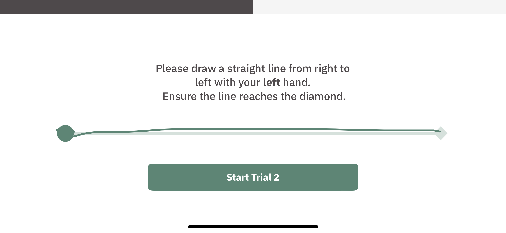
2. Trial 2 (Using the right hand):
   - Participants are asked to trace a line from left to right.
     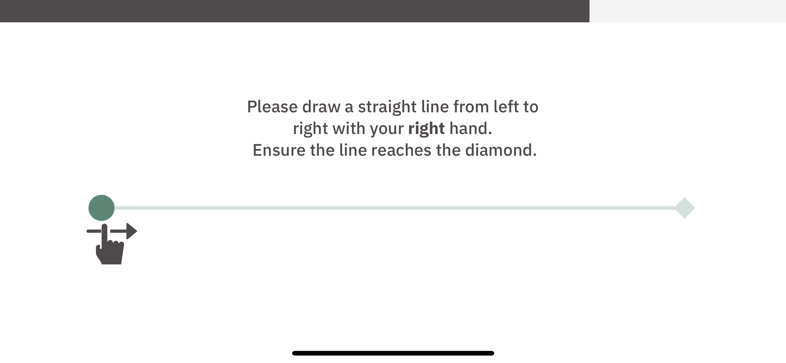
   - Once finished, participants can click "Next" to proceed.
     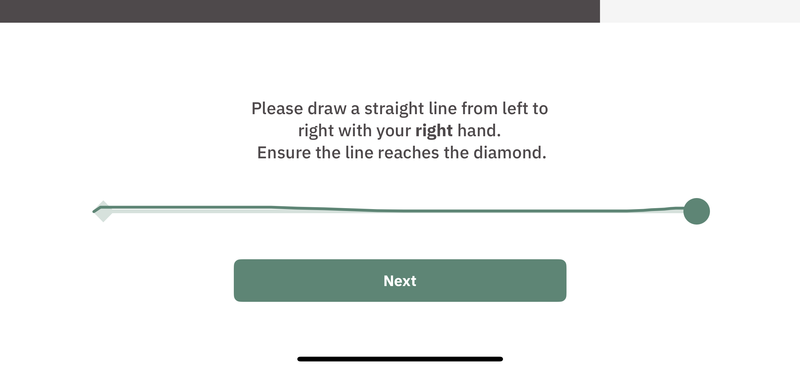
   - Participants are asked to trace a line from right to left.
     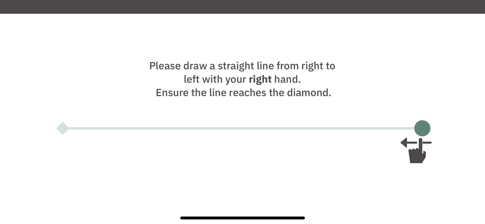
   - Once finished, participants can click "Next" to move to the next activity.
     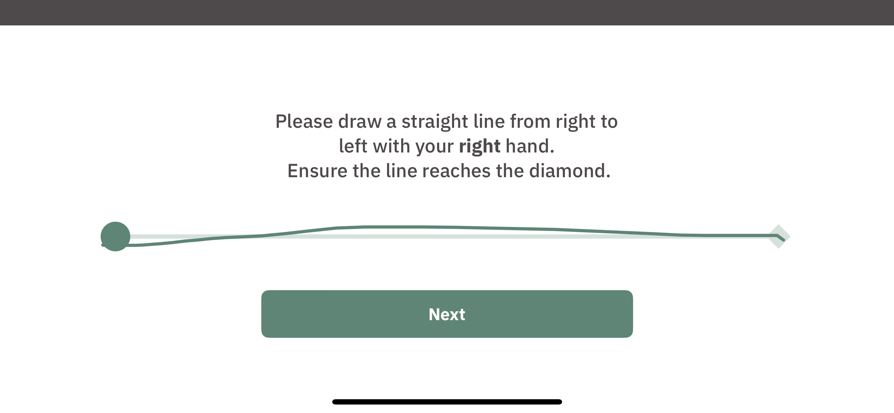

#### Response data
[WorkInProgress] This may change if required

Response data for this exercise includes the following:
- The device display size
  - Width and height
- For the reference line:
  - (x, y) coordinates of the start and end point of the line
- For the lines drawn by participants:
  - (x, y) coordinates of the points recorded for the lines

#### Exercise Result
The following example shows the JSON object structure used for this exercise result:

```json
{
  "exercise_id": "exercise05",
  "exercise_metadata": {
    "device_display": {
      "width": 1000,
      "height": 800
    },
    "ref_line_coords": {
      "start": [0, 0],
      "end": [10, 0]
    }
  },
  "exercise_result": {
    "left2right_left_hand":[[0, 0], [1, 1], [10, 2]],
    "right2left_left_hand":[[0, -1], [3, 1], [6, -1], [10, 0]],
    "left2right_right_hand":[[0, 1], [5, 0], [10, 0]],
    "right2left_right_hand":[[0, 0], [4, 0], [5, -1], [7, -1], [10, 1]]
  }
}
```

Let's try to understand the results recorded for this exercise using the fields of this JSON object.
##### `exercise_id` (string)
The default `exercise_id` value for exercise 5 is `exercise05`.

##### `exercise_metadata` (object)
The exercise metadata contains the following fields:
- `device_display` (object): Information about the display size
  - `width` (int): Display width
  - `height` (int): Display height
- `ref_line_coords` (object): (x, y) coordinates of the start and end point of the reference line
  - `start` (list): (x, y) coordinates of the starting point
  - `end` (list): (x, y) coordinates of the ending point

##### `exercise_result` (object)
This object contains the result using the following fields:
- `left2right_left_hand` (list): List of (x, y) coordinates of the points recorded for the line drawn with the left hand from left to right
- `right2left_left_hand` (list): List of (x, y) coordinates of the points recorded for the line drawn with the left hand from right to left
- `left2right_right_hand` (list): List of (x, y) coordinates of the points recorded for the line drawn with the right hand from left to right
- `right2left_right_hand` (list): List of (x, y) coordinates of the points recorded for the line drawn with the right hand from right to left

***

<a id="subsec-exercise06"></a>
### Exercise 6: DSST

#### Overview
In this exercise, participants are shown a reference set of symbols on the screen with a random number associated with each image. For each question in the exercise, a random symbol from the set is displayed on the screen. Participants are presented with the available number options used for the reference set and are expected to select the number that corresponds to the symbol in the reference set. Participants have 90 seconds to complete this task for as many symbols as possible. Low scores on the DSST are associated with AD, Parkinson's disease, stroke, disability and depression among other disordres. 

The exercise process is outlined as follows:
1. Exercise instructions are displayed. Participants can watch a demo with the "Watch Demo" button or click the "Start" button to begin the exercise.
   
2. During the exercise, the reference symbol set (legend) is displayed on the top half of the screen and the question symbols along with the numbers for answer options are displayed on the bottom half of the screen. Participants should tap the number corresponding to the symbol in the reference set (legend). The timer on in the top right corner shows the remaining time.
   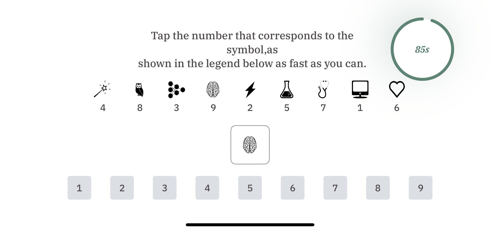
3. The timer stops after 90 seconds and the following screen is displayed. Participants can click "Next" for the next activity.
   

#### Response data
Response data for this exercise includes the following:
- Number of questions answered
- Answer value for each question
  - Correct answer value = **1**
  - Incorrect answer value = **0**

#### Exercise Result
The following example shows the JSON object structure used for this exercise result:

```json
{
  "exercise_id": "exercise06",
  "exercise_metadata": {},
  "exercise_result": [1, 1, 1, 1, 1, 1, 1, 1, 1, 1, 0, 1, 1, 1, 1, 1, 1, 1, 1, 1, 1, 1, 1, 1, 1, 1, 1, 1, 1, 1, 1, 1, 1, 1, 1, 1, 1, 1, 1, 1, 1, 1, 1, 1, 1, 1, 1, 1, 1, 1, 1, 1, 1]
}
```

Let's try to understand the results recorded for this exercise using the fields of this JSON object.
##### `exercise_id` (string)
The default `exercise_id` value for exercise 6 is `exercise06`.

##### `exercise_metadata` (object)
Currently, there is no additional information required to process the recorded results for this exercise. Thus, an empty object is present here.

##### `exercise_result` (list)
Contains the answers to the exercise questions (values 1 = correct answer, 0 = incorrect answer). The length of this list is equal to the number of questions answered.

***

<a id="subsec-exercise07"></a>
### Exercise 7: Stroop Test
#### Overview
This exercise is divided into three trials. For each trial, participants are expected to tap a checkmark or a cross symbol based on the instructions displayed on the screen. Questions across all trials use words that represent color names (for example: red, green, blue). The words themselves are colored. However, the color of a word may or may not match the word itself. Evidence exists linking head trauma and AD to increased Stroop effect. 

The following is a brief introduction of the instructions for the three trials:
- Trial 1:
  - Contains 5 questions
  - For each question, participants should 
    - Tap the checkmark as soon as a word appears
  - Participants have 6 seconds to answer a question
- Trial 2:
  - Contains 20 questions 
  - For each question, participants should
    - Tap the checkmark if the word displayed matches its color
    - Tap the cross if the word displayed does not match its color
  - Participants have 6 seconds to answer a question
- Trial 3:
  - Contains 20 questions 
  - For each question, participants should
    - Tap the checkmark if the word displayed does not match its color
    - Tap the cross if the word displayed matches its color
  - Participants have 6 seconds to answer a question

The exercise process is outlined as follows:
1. Instructions for trial 1 are displayed. Participants can click "Start" to start the trial.
   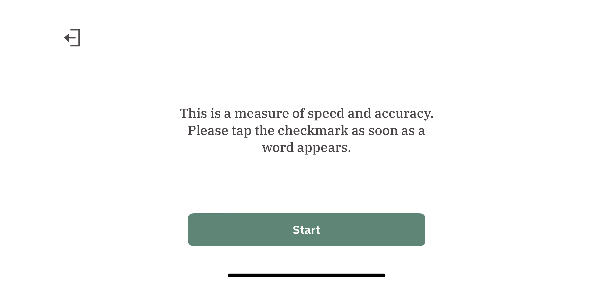
2. Questions for trial 1 are displayed sequentially. The timer in the top right corner of the screen displays the remaining time for a question.
   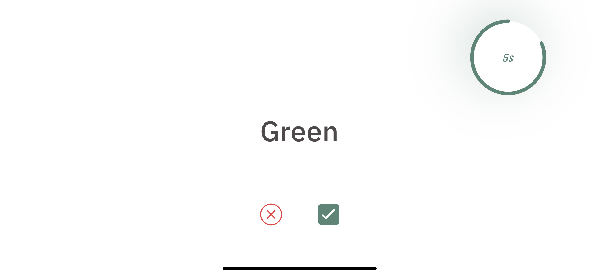
3. After trial 1 is completed, participants can click "Next Trial 2/3" to go to the next trial.
   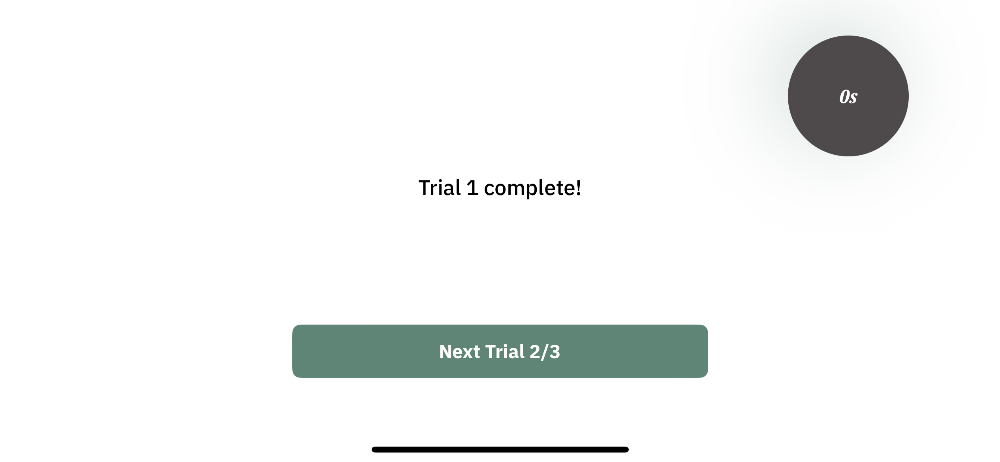
4. Instructions for trial 2 are displayed. Participants can click "Next" to start the trial.
   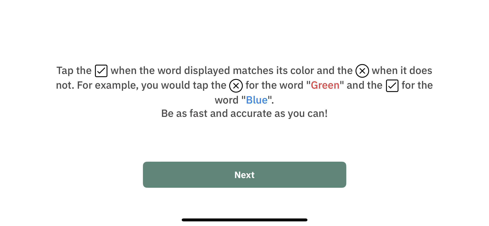
5. Questions for trial 2 are displayed sequentially. The timer in the top right corner of the screen displays the remaining time for a question.
   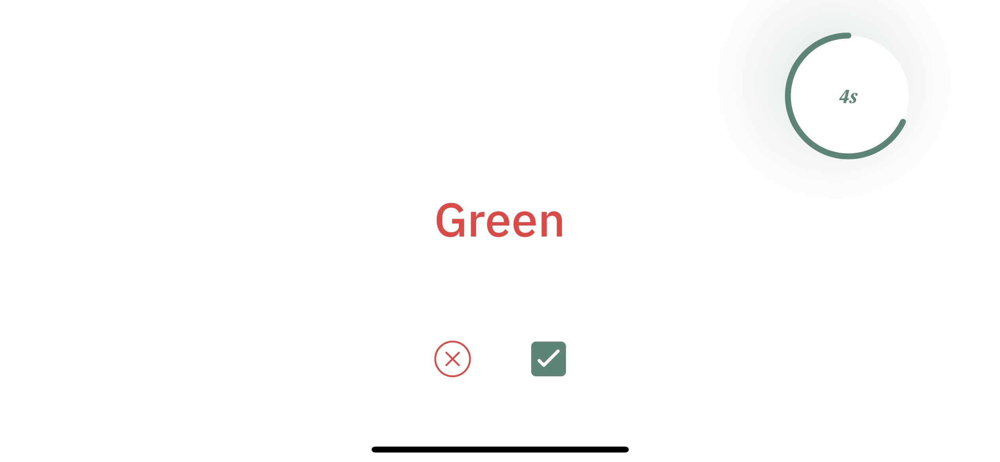
6. After trial 2 is completed, participants can click "Next Trial 3/3" to go to the next trial.
   
7. Instructions for trial 3 are displayed. Participants can click "Next" to start the trial.
   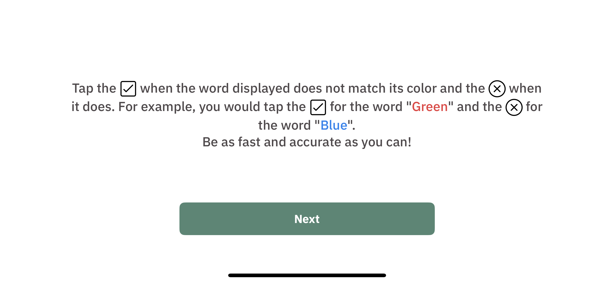
8. Questions for trial 3 are displayed sequentially. The timer in the top right corner of the screen displays the remaining time for a question.
   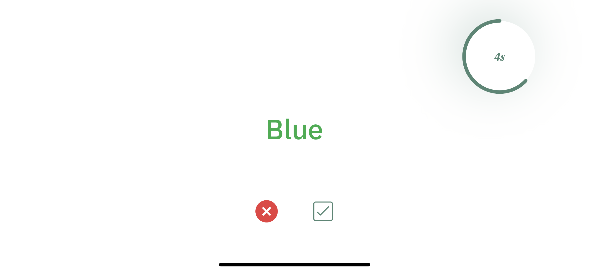
9. After trial 3 is completed, participants can click "Next" to go to the next activity.
   

#### Response data
Response data for this exercise includes the following:
- For each question:
  - Answer
    - Correct answer value = **1**
    - Incorrect answer value = **0**
    - Answer value if there was a timeout before an answer could be provided = **-1**
  - Reaction time, measured in milliseconds and starting from 0

#### Exercise Result
The following example shows the JSON object structure used for this exercise result:

```json
{
  "exercise_id": "exercise07",
  "exercise_metadata": {},
  "exercise_result": {
    "trial1": [
      {"answer": 1, "reaction_time":  2507},
      {"answer": 0, "reaction_time": 1423},
      {"answer": -1, "reaction_time": 6000},
      {"answer": 1, "reaction_time": 3567},
      {"answer": 1, "reaction_time": 1157}
    ],
    "trial2": [
      {"answer": 1, "reaction_time": 2507},
      {"answer": 1, "reaction_time": 1423},
      {"answer": 1, "reaction_time": 1281},
      {"answer": 1, "reaction_time": 3567},
      {"answer": 1, "reaction_time": 1157},
      {"answer": 1, "reaction_time": 2206},
      {"answer": 1, "reaction_time": 2442},
      {"answer": 1, "reaction_time": 4523},
      {"answer": 1, "reaction_time": 1328},
      {"answer": 1, "reaction_time": 862},
      {"answer": 1, "reaction_time": 1055},
      {"answer": 1, "reaction_time": 965},
      {"answer": 1, "reaction_time": 909},
      {"answer": 1, "reaction_time": 1414},
      {"answer": 1, "reaction_time": 1027},
      {"answer": 1, "reaction_time": 1221},
      {"answer": 1, "reaction_time": 1276},
      {"answer": 1, "reaction_time": 2478},
      {"answer": 1, "reaction_time": 1324},
      {"answer": 1, "reaction_time": 1242},
      {"answer": 1, "reaction_time": 1944}
    ],
    "trial3": [
      {"answer": 1, "reaction_time": 1241},
      {"answer": 1, "reaction_time": 2840},
      {"answer": 1, "reaction_time": 1729},
      {"answer": 1, "reaction_time": 1226},
      {"answer": 1, "reaction_time": 945},
      {"answer": 1, "reaction_time": 1303},
      {"answer": 0, "reaction_time": 1042},
      {"answer": 1, "reaction_time": 941},
      {"answer": 1, "reaction_time": 1010},
      {"answer": 1, "reaction_time": 789},
      {"answer": 1, "reaction_time": 1417},
      {"answer": 1, "reaction_time": 1120},
      {"answer": 1, "reaction_time": 1379},
      {"answer": 1, "reaction_time": 1043},
      {"answer": 1, "reaction_time": 1613},
      {"answer": 1, "reaction_time": 2281},
      {"answer": 1, "reaction_time": 2224},
      {"answer": 1, "reaction_time": 5134},
      {"answer": 1, "reaction_time": 1281}
    ]
  }
}
```

Let's try to understand the results recorded for this exercise using the fields of this JSON object.
##### `exercise_id` (string)
The default `exercise_id` value for exercise 7 is `exercise07`.

##### `exercise_metadata` (object)
Currently, there is no additional information required to process the recorded results for this exercise. Thus, an empty object is present here.

##### `exercise_result` (object)
This object contains the result using the following fields:
- `trial1` (list): List containing answer objects for trial 1 with the following fields:
  - `answer` (int): Answer for a question (values 1 = correct answer, 0 = incorrect answer, -1 = timeout)
  - `reaction_time` (int): Time taken to answer the question, measured in milliseconds and starting from 0

- `trial2` (list): List containing answer objects for trial 2 with the following fields:
  - `answer` (int): Answer for a question (values 1 = correct answer, 0 = incorrect answer, -1 = timeout)
  - `reaction_time` (int): Time taken to answer the question, measured in milliseconds and starting from 0

- `trial3` (list): List containing answer objects for trial 3 with the following fields:
  - `answer` (int): Answer for a question (values 1 = correct answer, 0 = incorrect answer, -1 = timeout)
  - `reaction_time` (int): Time taken to answer the question, measured in milliseconds and starting from 0

***

<a id="subsec-exercise08"></a>
### Exercise 8: Picture description

#### Overview

In this exercise, participants are presented with a picture and asked to describe what is happening in the picture in detail within a 5-minute time limit. A random picture from a set of pictures is used every time. Picture description tasks can be used to analyze both the acoustic and linguistic features of speech, providing insight into one's cognitive health.

The exercise process is outlined as follows:
1. Exercise instructions are displayed. Participants can click "Start game" to start the exercise.
   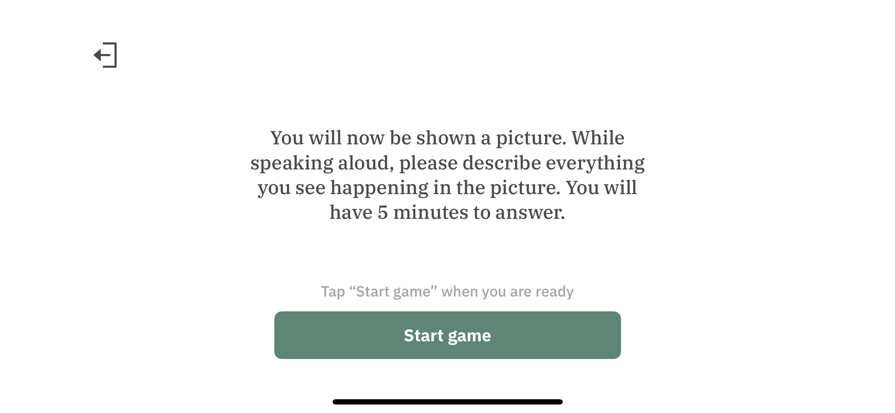
2. Participants are presented with a picture and asked to describe the picture out loud. The timer in the top right corner of the screen displays the remaining time. Participants can record their response here and click "Done" to proceed to the next activity.
   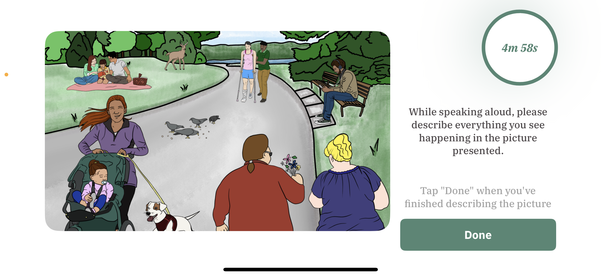

#### Response data
The speech response is recorded using a single 32-bit, mono, `.wav` audio file with 22050Hz sample rate.

#### Exercise Result
The following example shows the JSON object structure used for this exercise result:

```json
{
  "exercise_id": "exercise08",
  "exercise_metadata": {
    "reference_picture_path": "path/to/the/reference/picture"
  },
  "exercise_result": {
    "file_path": "path/to/the/audio/file"
  }
}
```

Let's try to understand the results recorded for this exercise using the fields of this JSON object.
##### `exercise_id` (string)
The default `exercise_id` value for exercise 8 is `exercise08`.

##### `exercise_metadata` (object)
This object contains some additional information about the exercise results using the following fields:
- `reference_picture_path` (string): Path to the reference picture used to record the response

##### `exercise_result` (object)
This object contains the result using the following fields:
- `file_path` (string): Path to the location of the audio file with speech response

***

<a id="subsec-exercise09"></a>
### Exercise 9: Unstructured voice tasks (Verbal fluency)

#### Overview
In this exercise assessing verbal fluenncy, participants asked to say as many unique words as possible for a given category within a 1-minute time limit.

The exercise process is outlined as follows:
1. Exercise instructions are displayed. Participants can click "Start game" to start the exercise.
   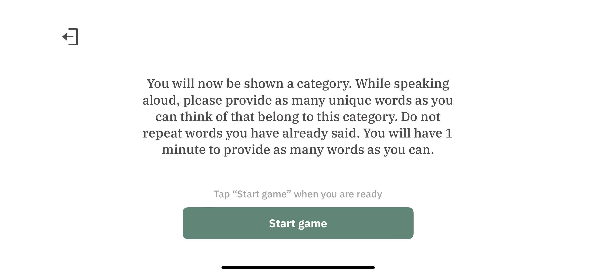
2. Participants are presented with a category and asked to say as many unique words as possible for the given category. The timer in the top right corner of the screen displays the remaining time. 
   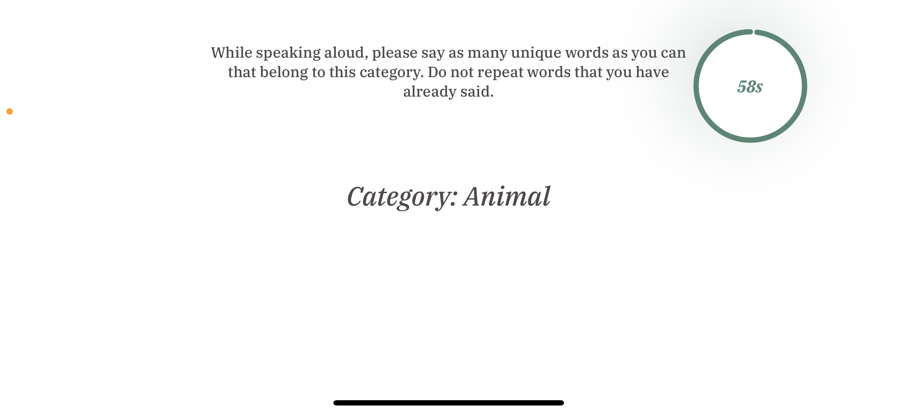
3. After the 1-minute time limit, participants can click "Done" to go to the next activity.
   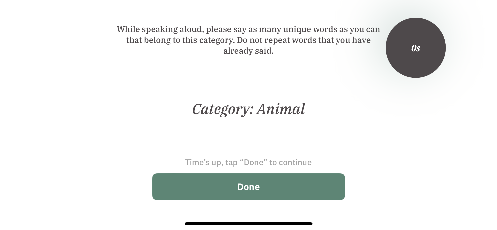

#### Response data
The speech response is recorded using a single 32-bit, mono, `.wav` audio file with 22050Hz sample rate.

#### Exercise Result
The following example shows the JSON object structure used for this exercise result:

```json
{
  "exercise_id": "exercise09",
  "exercise_metadata": {
    "question_category": "sample_category_name"
  },
  "exercise_result": {
    "file_path": "path/to/the/audio/file"
  }
}
```

Let's try to understand the results recorded for this exercise using the fields of this JSON object.
##### `exercise_id` (string)
The default `exercise_id` value for exercise 9 is `exercise09`.

##### `exercise_metadata` (object)
This object contains some additional information about the exercise results using the following fields:
- `question_category` (string): The category for the question

##### `exercise_result` (object)
This object contains the result using the following fields:
- `file_path` (string): Path to the location of the audio file with speech response

***

<a id="subsec-exercise10"></a>
### Exercise 10: Orientation questions

#### Overview
In this exercise, participants are asked to answer a series of questions that elicit brief speech responses. Participants have 90 seconds to answer each question.

The exercise process is outlined as follows:
1. Exercise instructions are displayed. Participants can click "Start game" to start the exercise.
   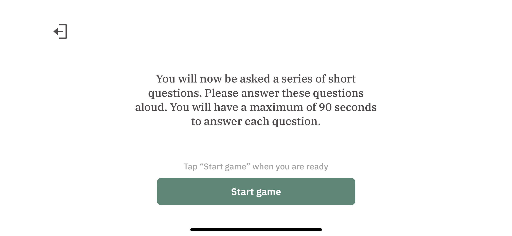
2. Exercise questions are displayed sequentially. The timer in the top right corner displays the time remaining to record the response for a question. Participants can click "Next" to go to the next question.
   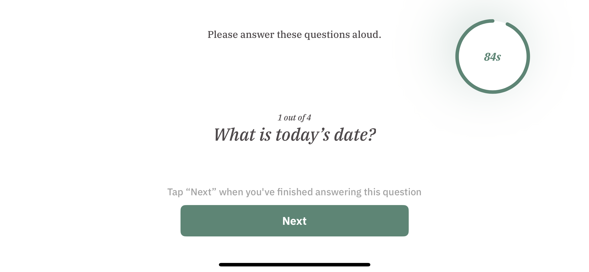
5. After completing the last question, participants can click "Done" for the next activity.
   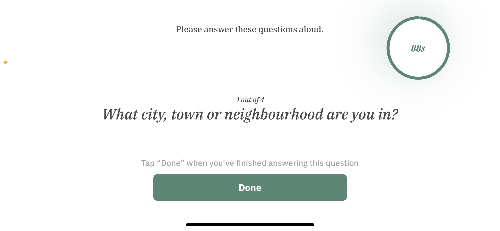

#### Response data
The speech response is recorded using a single 32-bit, mono, `.wav` audio file with 22050Hz sample rate. Along with the speech response, exercise questions and timestamps separating different answers in the speech response are also recorded. Timestamps are measured in milliseconds and starting from 0.

#### Exercise Result
The following example shows the JSON object structure used for this exercise result:

```json
{
  "exercise_id": "exercise10",
  "exercise_metadata": {
    "questions": ["sample_question1", "sample_question_2", "sample_question_3", "sample_question_4"]
  },
  "exercise_result": {
    "file_path": "path/to/the/audio/file",
    "answers_timestamps": [90000, 180000, 270000, 360000]
  }
}
```

Let's try to understand the results recorded for this exercise using the fields of this JSON object.
##### `exercise_id` (string)
The default `exercise_id` value for exercise 10 is `exercise10`.

##### `exercise_metadata` (object)
This object contains some additional information about the exercise results using the following fields:
- `questions` (list): List of questions used for the exercise

##### `exercise_result` (object)
This object contains the result using the following fields:
- `file_path` (string): Path to the location of the audio file with speech response
- `answers_timestamps` (list): List of timestamps separating the different answers in the recorded speech response

***

<a id="subsec-exercise11"></a>
### Exercise 11: Unstructured voice tasks (Open-ended questions)

#### Overview
In this exercise, participants are asked an open-ended question about their daily routine or a general activity. A random question is selected from a set of questions each time. A short speech recording is expected in response. Participants have a 90-second time limit to record their response.

The exercise process is outlined as follows:
1. Exercise instructions are displayed. Participants can click "Start game" to start the exercise.
   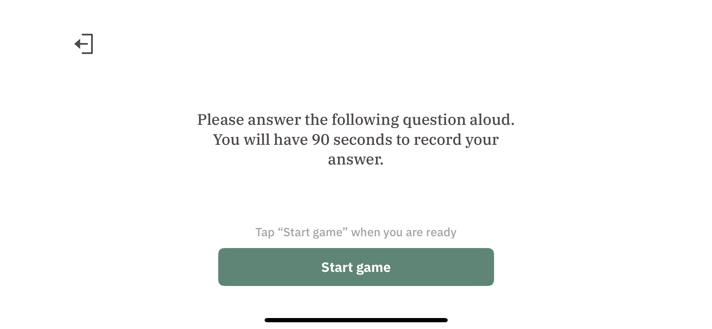
2. The exercise question is displayed on the screen. Participants have 90 seconds to record their answer. The timer in the top right corner of the screen displays the remaining time. Participants can click "Done" when they have finished responding.
   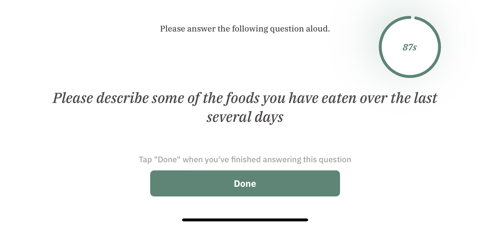

#### Response data
The speech response is recorded using a single 32-bit, mono, `.wav` audio file with 22050Hz sample rate.

#### Exercise Result
The following example shows the JSON object structure used for this exercise result:

```json
{
  "exercise_id": "exercise11",
  "exercise_metadata": {
    "question": "sample_question"
  },
  "exercise_result": {
    "file_path": "path/to/the/audio/file"
  }
}
```

Let's try to understand the results recorded for this exercise using the fields of this JSON object.
##### `exercise_id` (string)
The default `exercise_id` value for exercise 11 is `exercise11`.

##### `exercise_metadata` (object)
This object contains some additional information about the exercise results using the following fields:
- `question` (list): The question used

##### `exercise_result` (object)
This object contains the result using the following fields:
- `file_path` (string): Path to the location of the audio file with speech response

***

<a id="subsec-exercise12"></a>
### Exercise 12: Reaction time exercise

#### Overview
This exercise requires participants to tap a flag as soon as it appears on the screen, and this flag-based task is repeated 20 times.

The exercise process is outlined as follows:
1. Exercise instructions are displayed. Participants can click "Start game" to start the exercise.
   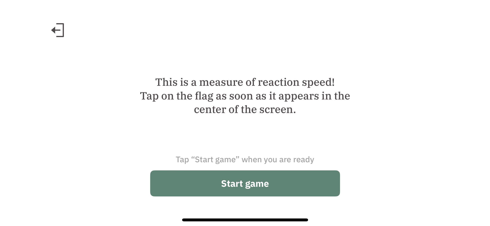
2. During the exercise, a flag randomly appears on the screen. Participants have a 5-second time limit to tap the flag, after which it disappears, and a new flag takes its place after a brief interval.
   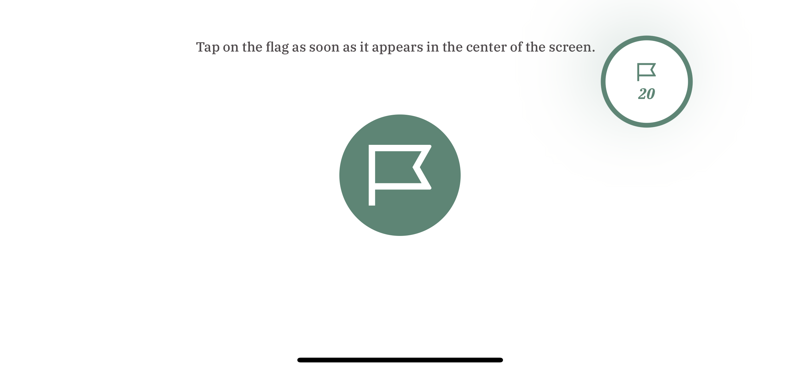
3. After finishing the exercise, participants can click "Done" to exit the exercise.
   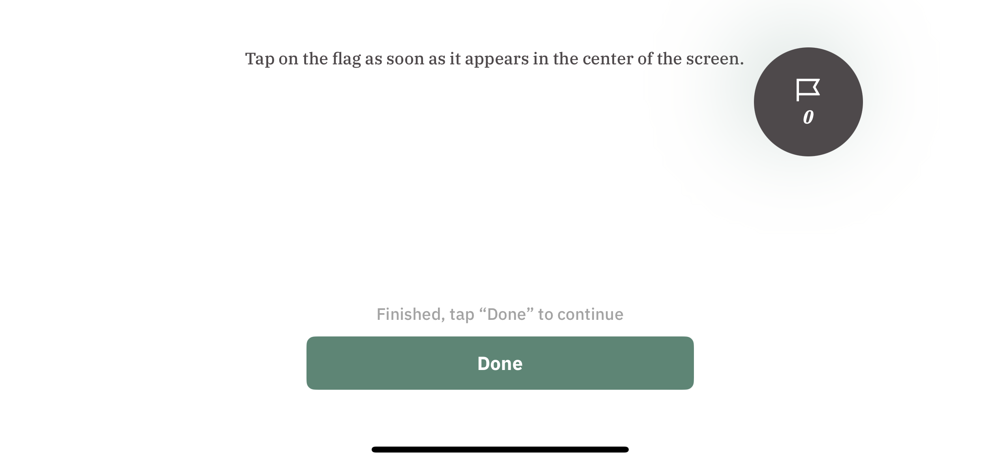

#### Response data
For each flag task, the following information is recorded
- Whether there was a tap or not. No tap in this exercise is equivalent to a timeout. The answer values recorded are:
  - If there was a tap = **1**
  - If there was a timeout/no tap = **-1**
- Reaction time measured in milliseconds starting from 0
  - In case of a timeout, the reaction time value will be 5000 because the time limit for each flag is 5 seconds

#### Exercise Result
The following example shows the JSON object structure used for this exercise result:

```json
{
  "exercise_id": "exercise12",
  "exercise_metadata": {},
  "exercise_result": [
    {"answer": 1, "reaction_time": 531},
    {"answer": 1, "reaction_time": 627},
    {"answer": 1, "reaction_time": 655},
    {"answer": 1, "reaction_time": 673},
    {"answer": 1, "reaction_time": 537},
    {"answer": 1, "reaction_time": 711},
    {"answer": 1, "reaction_time": 503},
    {"answer": 1, "reaction_time": 537},
    {"answer": 1, "reaction_time": 603},
    {"answer": 1, "reaction_time": 570},
    {"answer": 1, "reaction_time": 5000},
    {"answer": -1, "reaction_time": 5000},
    {"answer": -1, "reaction_time": 5000},
    {"answer": -1, "reaction_time": 5000},
    {"answer": -1, "reaction_time": 5000},
    {"answer": -1, "reaction_time": 5000},
    {"answer": -1, "reaction_time": 5000},
    {"answer": -1, "reaction_time": 5000},
    {"answer": -1, "reaction_time": 5000},
    {"answer": -1, "reaction_time": 5000}
  ]
}
```

Let's try to understand the results recorded for this exercise using the fields of this JSON object.
##### `exercise_id` (string)
The default `exercise_id` value for exercise 12 is `exercise12`.

##### `exercise_metadata` (object)
Currently, there is no additional information required to process the recorded results for this exercise. Thus, an empty object is present here.
##### `exercise_result` (list)

This list contains responses for each question using objects with the following fields:
- `answer` (int): Answer value for a question (values: 1 = tap, -1 = timeout/no tap)
- `reaction_time` (int): Reaction time for the question, measured in milliseconds and starting from 0


<a id="sec-battery-result-example-all-exercises"></a>
## Battery Result Example With All Exercises
The following is an example of a battery result containing all exercises available with NeuroLup at the time of writing this document.

```json
{
  "battery_metadata": {
    "participant_id": "email_or_username",
    "program_name": "sample_program_name",
    "battery_name": "sample_battery_name",
    "created_at": "creation_date_and_time",
    "updated_at": "updation_date_and_time",
    "device_info":  {}
  },
  "battery_result": {
    "exercise01": {
      "exercise_id": "exercise01",
      "exercise_metadata": {},
      "exercise_result": {
        "file_path": "path/to/the/audio/file"
      }
    },
    "exercise02": {
      "exercise_id": "exercise02",
      "exercise_metadata": {},
      "exercise_result": {
        "file_path": "path/to/the/audio/file"
      }
    },
    "exercise03": {
      "exercise_id": "exercise03",
      "exercise_metadata": {},
      "exercise_result": {
        "trial1": [
          {
            "answered_pos": [9],
            "target_pos": [9]
          },
          {
           "answered_pos": [3],
           "target_pos": [3]
          },
          {
           "answered_pos": [3],
           "target_pos": [3]
          },
          {
           "answered_pos": [-1],
           "target_pos": [4]
          },
          {
           "answered_pos": [0],
           "target_pos": [6]
          }
        ],
        "trial2": [
          {
           "answered_pos": [6, 7, -1],
           "target_pos": [6, 7, 8]
          },
          {
           "answered_pos": [1, 0, 0],
           "target_pos": [1, 2, 4]
          },
          {
           "answered_pos": [-1, -1, -1],
           "target_pos": [5, 7, 9]
          },
          {
           "answered_pos": [0, 0, 0],
           "target_pos": [1, 4, 5]
          },
          {
           "answered_pos": [2, 3, 5],
           "target_pos": [2, 3, 5]
          },
          {
           "answered_pos": [5, 6, 9],
           "target_pos": [5, 6, 9]
          },
          {
           "answered_pos": [1, 2, 0],
           "target_pos": [1, 2, 5]
          },
          {
           "answered_pos": [1, 2, 3],
           "target_pos": [9, 4, 2]
          },
          {
           "answered_pos": [4, 6, 8],
           "target_pos": [4, 6, 8]
          },
          {
           "answered_pos": [4, 5, 9],
           "target_pos": [4, 5, 9]
          } 
        ],
        "trial3": [
          {
            "answered_pos": [2, 4, 5, 6, 7],
            "target_pos": [2, 4, 5, 6, 7]
          },
          {
           "answered_pos": [2, 3, 6, 8, 9],
           "target_pos": [2, 3, 6, 8, 9]
          },
          {
           "answered_pos": [2, 5, 6, 8, 9],
           "target_pos": [9, 8, 6, 5, 1]
          },
          {
           "answered_pos": [1, 2, 4, 5, 9],
           "target_pos": [1, 2, 4, 5, 9]
          },
          {
           "answered_pos": [1, 6, 7, 8, 9],
           "target_pos": [1, 6, 7, 8, 9]
          },
          {
           "answered_pos": [2, 3, 4, 5, 6],
           "target_pos": [3, 2, 4, 5, 6]
          },
          {
           "answered_pos": [1, 2, 4, 7, 8],
           "target_pos": [1, 2, 4, 7, 8]
          },
          {
           "answered_pos": [2, 3, 4, 7, 8],
           "target_pos": [3, 2, 4, 7, 8]
          },
          {
           "answered_pos": [1, 2, 6, 7, 8],
           "target_pos": [1, 2, 6, 8, 7]
          },
          {
           "answered_pos": [2, 3, 6, 8, 9],
           "target_pos": [2, 3, 6, 8, 9]
          }
        ]
      }
    },
    "exercise04": {
      "exercise_id": "exercise04",
      "exercise_metadata": {},
      "exercise_result": {
        "right_index_finger_taps": [17, 38, 58, 81, 102, 127, 147, 169, 192, 212, 232, 252, 272, 290, 312, 330, 349, 367, 389, 405, 425, 445, 464, 482, 502, 519, 539, 557, 579, 599, 619, 639, 657, 679, 699, 715, 735, 754, 772, 792, 809, 830, 852, 872, 892, 910, 928, 947, 963, 983],
        "left_index_finger_taps": [15, 35, 55, 75, 93, 115, 132, 152, 170, 188, 206, 222, 240, 259, 279, 299, 317, 337, 355, 377, 397, 417, 435, 457, 474, 494, 515, 532, 552, 570, 589, 609, 630, 650, 670, 690, 712, 732, 752, 774, 795, 814, 834, 854, 872, 894, 912, 930, 952, 972, 992]
      }
    },
    "exercise05": {
      "exercise_id": "exercise05",
      "exercise_metadata": {
        "device_display": {
          "width": 1000,
          "height": 800
        },
        "ref_line_coords": {
          "start": [0, 0],
          "end": [10, 0]
        }
      },
      "exercise_result": {
        "left2right_left_hand":[[0, 0], [1, 1], [10, 2]],
        "right2left_left_hand":[[0, -1], [3, 1], [6, -1], [10, 0]],
        "left2right_right_hand":[[0, 1], [5, 0], [10, 0]],
        "right2left_right_hand":[[0, 0], [4, 0], [5, -1], [7, -1], [10, 1]]
      }
    },
    "exercise06": {
      "exercise_id": "exercise06",
      "exercise_metadata": {},
      "exercise_result": [1, 1, 1, 1, 1, 1, 1, 1, 1, 1, 0, 1, 1, 1, 1, 1, 1, 1, 1, 1, 1, 1, 1, 1, 1, 1, 1, 1, 1, 1, 1, 1, 1, 1, 1, 1, 1, 1, 1, 1, 1, 1, 1, 1, 1, 1, 1, 1, 1, 1, 1, 1, 1]
    },
    "exercise07": {
      "exercise_id": "exercise07",
      "exercise_metadata": {},
      "exercise_result": {
        "trial1": [
          {"answer": 1, "reaction_time":  2507},
          {"answer": 0, "reaction_time": 1423},
          {"answer": -1, "reaction_time": 6000},
          {"answer": 1, "reaction_time": 3567},
          {"answer": 1, "reaction_time": 1157}
        ],
        "trial2": [
          {"answer": 1, "reaction_time": 2507},
          {"answer": 1, "reaction_time": 1423},
          {"answer": 1, "reaction_time": 1281},
          {"answer": 1, "reaction_time": 3567},
          {"answer": 1, "reaction_time": 1157},
          {"answer": 1, "reaction_time": 2206},
          {"answer": 1, "reaction_time": 2442},
          {"answer": 1, "reaction_time": 4523},
          {"answer": 1, "reaction_time": 1328},
          {"answer": 1, "reaction_time": 862},
          {"answer": 1, "reaction_time": 1055},
          {"answer": 1, "reaction_time": 965},
          {"answer": 1, "reaction_time": 909},
          {"answer": 1, "reaction_time": 1414},
          {"answer": 1, "reaction_time": 1027},
          {"answer": 1, "reaction_time": 1221},
          {"answer": 1, "reaction_time": 1276},
          {"answer": 1, "reaction_time": 2478},
          {"answer": 1, "reaction_time": 1324},
          {"answer": 1, "reaction_time": 1242},
          {"answer": 1, "reaction_time": 1944}
        ],
        "trial3": [
          {"answer": 1, "reaction_time": 1241},
          {"answer": 1, "reaction_time": 2840},
          {"answer": 1, "reaction_time": 1729},
          {"answer": 1, "reaction_time": 1226},
          {"answer": 1, "reaction_time": 945},
          {"answer": 1, "reaction_time": 1303},
          {"answer": 0, "reaction_time": 1042},
          {"answer": 1, "reaction_time": 941},
          {"answer": 1, "reaction_time": 1010},
          {"answer": 1, "reaction_time": 789},
          {"answer": 1, "reaction_time": 1417},
          {"answer": 1, "reaction_time": 1120},
          {"answer": 1, "reaction_time": 1379},
          {"answer": 1, "reaction_time": 1043},
          {"answer": 1, "reaction_time": 1613},
          {"answer": 1, "reaction_time": 2281},
          {"answer": 1, "reaction_time": 2224},
          {"answer": 1, "reaction_time": 5134},
          {"answer": 1, "reaction_time": 1281}
        ]
      }
    },
    "exercise08": {
      "exercise_id": "exercise08",
      "exercise_metadata": {
        "reference_picture_path": "path/to/the/reference/picture"
      },
      "exercise_result": {
        "file_path": "path/to/the/audio/file"
      }
    },
    "exercise09": {
      "exercise_id": "exercise09",
      "exercise_metadata": {
        "question_category": "sample_category_name"
      },
      "exercise_result": {
        "file_path": "path/to/the/audio/file"
      }
    },
    "exercise10": {
      "exercise_id": "exercise10",
      "exercise_metadata": {
        "questions": ["sample_question1", "sample_question_2", "sample_question_3", "sample_question_4"]
      },
      "exercise_result": {
        "file_path": "path/to/the/audio/file",
        "answers_timestamps": [90000, 180000, 270000, 360000]
      }
    },
    "exercise11": {
      "exercise_id": "exercise11",
      "exercise_metadata": {
        "question": "sample_question"
      },
      "exercise_result": {
        "file_path": "path/to/the/audio/file"
      }
    },
    "exercise12": {
      "exercise_id": "exercise12",
      "exercise_metadata": {},
      "exercise_result": [
        {"answer": 1, "reaction_time": 531},
        {"answer": 1, "reaction_time": 627},
        {"answer": 1, "reaction_time": 655},
        {"answer": 1, "reaction_time": 673},
        {"answer": 1, "reaction_time": 537},
        {"answer": 1, "reaction_time": 711},
        {"answer": 1, "reaction_time": 503},
        {"answer": 1, "reaction_time": 537},
        {"answer": 1, "reaction_time": 603},
        {"answer": 1, "reaction_time": 570},
        {"answer": 1, "reaction_time": 5000},
        {"answer": -1, "reaction_time": 5000},
        {"answer": -1, "reaction_time": 5000},
        {"answer": -1, "reaction_time": 5000},
        {"answer": -1, "reaction_time": 5000},
        {"answer": -1, "reaction_time": 5000},
        {"answer": -1, "reaction_time": 5000},
        {"answer": -1, "reaction_time": 5000},
        {"answer": -1, "reaction_time": 5000},
        {"answer": -1, "reaction_time": 5000}
      ]
    }
  }
}
```
